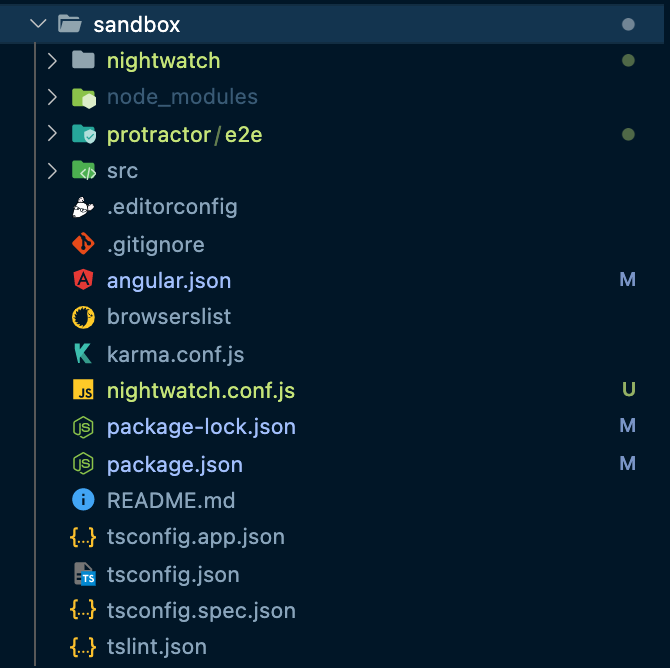

# Migrating from Protractor to Nightwatch

## Introduction

Protractor was a popular end-to-end test framework for Angular and 
Protractor was a popular end-to-end test framework for Angular and AngularJS applications. However, Protractor will [no longer be shipped][AngualarRFC] with the new Angular Projects as of Angular 12. We've got you covered with this migration guide to help make the transition from Protector on your team to Nightwatch easier.


### What is Nightwatch?

Nightwatch.js is an automated end-to-end testing framework for web applications and websites. It is written in Node.js and uses the W3C WebDriver API (formerly Selenium WebDriver) for interacting with various browsers.

It is a complete testing solution which aims to simplify writing tests and setting up Continuous Integration and Continuous Delivery. Nightwatch can also be used for writing Node.js unit and integration tests. Read more about how Nightwatch was created here.

> If you believe this migration guide has any missing information or is wrongly misrepresented, then please raise an issue here.

## Benefits of using Nightwatch
Many developers fail to thoroughly test their products because they have to look at every nook and cranny of the product and ensure no mistakes have been made.
With the advent of automation, automated testing frameworks like Nightwatch came to the rescue.

Nightwatch.js facilitates end-to-end functional browser tests in a pure Node.js environment, allowing testing of web apps independent of third party software.

The main features offered by Nightwatch are:

- **Clean Syntax** - Simple yet powerful syntax helps testers quickly write more efficient and effective test cases for web element selectors using JavaScript and CSS or XPath.
- **In-built CLI test runner** - Inbuilt command-line test runner for automation execution with retry and implicit wait.
- **Selenium Server** - Ability to manage Selenium or various WebDriver (ChromeDriver, GeckoDriver, etc.)
- **Flexible command and assertions** - Various assertions and commands for Document Object Model (DOM) operations, XPath and CSS selectors can be used to identify page elements. That's what makes this framework flexible and easy to extend, especially when executing application-specific assertions and commands.
- **Continuous Integration (CI)** - It can be easily integrated with continuous build process systems like Jenkins, TeamCity, etc. and provides inbuilt Junit XML reporting, which can continually help software developers build and test their application.
- **Easy to scale** - It can easily be extended to write custom commands and assertions for testing.
- **Cloud Services Support** - It provides excellent support for cloud-based testing platforms such as BrowserStack and supports cross-browser tests with Selenium JavaScript.
- **Stability** - Nightwatch is stable in terms of performance in automated testing.
- **Page Object Model** - It makes automated testing more flexible by providing a page object model and supporting CSS and Xpath selectors.
- **Easy to plugin with other frameworks** - Nightwatch provides excellent support for extending different like [Selenium][SeleniumPluginExtendLink], [WebdriverIO][WebdriverIOPluginExtendLink], etc.

## Getting Started

We recommend using our official Nightwatch Angular schematic to add Nightwatch to your angular project.

```sh
ng add @nightwatch/schematics
```

This command will install Nightwatch, add different scripts to run Nightwatch, scaffold Nightwatch config, and test files. It also prompts you to remove Protractor from your project and reconfigure your default `ng e2e` command to use Nightwatch.

Now we had installed the schematic and Protractor being removed. You can now run Nightwatch with the following command

```sh
ng e2e
```

You can also use the following command to run Nightwatch alternatively.

```sh
ng run {your-project-name}:nightwatch-run
```

## Next Steps

After you add a Nightwatch to your angular project. Your existing e2e tests will be migrated to a new location i.e. `Protractor`. Sample tests will be added to the `Nightwatch` folder to get you started with your first test in Nightwatch.

You will see these changes in your project, after you had run schematics on your project.



1. Now, You need to modify your existing tests to Nightwatch. To being with you can start with [Assertions][AssertionLink], [Expect][ExceptLink], [Page Objects][PageObjectLink] and [API commands][APICommandsLink].

2. We had added few examples in this guide, but if you need more information please visit: https://nightwatchjs.org/api/

> Check out our [Nightwatch Schematic documentation][NightwatchSchematicDocumentation] for more details like running tests in a specific browser, etc.

## Working with the DOM

### Getting the DOM Elements

#### Getting a single element

---

In e2e tests, one of the most common things to do in a webpage is to get one or more HTML elements. In Nightwatch, you don't need to make any changes here, as everything works as before.

<span>Before: Protractor</span>

```js
// Find an element using a css selector.
element(by.css('.myclass'))

// Find an element with the given id.
element(by.id('myid'))

// Find an element using an input name selector.
element(by.name('input_name'))

// Find an element containing a specific text (only for link elements)
element(by.linkText('anchor_link'))

// Find an element using a tag name
element(by.tagName('tag'))

// Find an element using xpath
element(by.xpath('//element1/element2'))
```

<span>After: Nightwatch</span>

```js
// Find an element using a css selector.
element(by.css('.myclass'))

// Find an element with the given id.
element(by.id('myid'))

// Find an element using an input name selector.
element(by.name('input_name'))

// Find an element containing a specific text (only for link elements)
element(by.linkText('anchor_link'))

// Find an element using a tag name
element(by.tagName('tag'))

// Find an element using xpath
element(by.xpath('//element1/element2'))
```

#### Getting multiple elements

---

If you need to access more than one element on the page, you must chain the .all() method. However, in Nightwatch, you can use `browser.elements`.

<span>Before: Protractor</span>

```js
// Find elements using a css selector.
element.all(by.css('.myclass'))

// Find elements with the given id.
element.all(by.id('myid'))

// Find elements using an input name selector.
element.all(by.name('input_name'))

// Find elements containing a specific text (only for link elements)
element.all(by.linkText('anchor_link'))

// Find elements using a tag name
element.all(by.tagName('tag'))

// Find elements using xpath
element.all(by.xpath('//element1/element2'))
```

<span>After: Nightwatch</span>

```js
// Find an element using a css selector.
browser.elements('css selector', '.myclass')

// Find an element with the given id.
browser.elements('css selector', 'myid')

// Find an element using an input name selector.
browser.elements('tag name', 'input_name')

// Find an element containing a specific text (only for link elements)
browser.elements('link_text', 'anchor_link')

// Find an element using a tag name
browser.elements('tag name', 'tag')

// Find an element using xpath
browser.elements('xpath', '//element1/element2')
```

> You can learn more about in our [official documentation][ElementDocumentationLink]

### Interaction with DOM Elements

<span>Before: Protractor</span>

```js
// Click on the element
element(by.css('button')).click()

// Clear the text in an element (usually an input).
element(by.css('input')).clear()

// Check the first checkbox on a page
element.all(by.css('[type="checkbox"]')).first().click()

// Scroll an element into view
browser
  .actions()
  .mouseMove(element(by.id('my-id')))
  .perform()
```

<span>After: Nightwatch</span>

```js
// Click on the element
browser.click(element(by.css('button')))

// Clear the text in an element (usually an input).
browser.clearValue(element(by.css('input')))

// Check the first checkbox on a page
// Nightwatch by default search for first element, and perform click event if there are multiple element present
browser.click(element(by.css('[type="checkbox"]')))

// Scroll an element into view
browser.moveToElement(element(by.id('my-id'), 0, 0)
```

> You can learn more about interacting with DOM elements in our [official documentation][ElementInteractionDocLink]

## Assertions

### Length

<span>Before: Protractor</span>

```js
const list = element.all(by.css('custom-class'))
expect(list.count()).toBe(3)
```

<span>After: Nightwatch</span>

```js
expect.elements('.custom-class').count.to.equal(3);
```

### Value

<span>Before: Protractor</span>

```js
expect(element(by.tagName('input[name="first_name"]'))).getAttribute('value')).toBe('foo')
```

<span>After: Nightwatch</span>

```js
browser.expect.element('input[name="first_name"]').to.have.attribute('value').equals('foo');
```

### Text Content

<span>Before: Protractor</span>

```js
// assert the element\'s text content is exactly the given text
expect(element(by.id('user-name')).getText()).toBe('John Doe')
```

<span>After: Nightwatch</span>

```js
browser.expect.element('#user-name').text.to.equal('John Doe');
```

### Visibility

<span>Before: Protractor</span>

```js
// assert button is visible
expect(element(by.tagName('#main ul li a.first')).isDisplayed()).toBe(true)
```

<span>After: Nightwatch</span>

```js
browser.expect.element('#main ul li a.first').to.be.visible;

// The following will end the test:
browser.assert.visible('#main ul li a.first');

// However this will just log the failure and continue:
browser.verify.visible('#main ul li a.first');
```

### Existence

<span>Before: Protractor</span>

```js
// assert the spinner no longer exists
expect(element(by.id('loading')).isPresent()).toBe(false)
```

<span>After: Nightwatch</span>

```js
browser.assert.not.elementPresent('.not_present')
```

### CSS

<span>Before: Protractor</span>

```js
// assert #main ul li a.first has css style "block" for "display" property
expect(element(by.css('#main ul li a.first')).getCssValue('display')).toBe('block')
```

<span>After: Nightwatch</span>

```js
browser.getCssProperty('#main ul li a.first', 'display', function(result) {
  this.assert.equal(result.value, 'block')
});
```

### Navigating Websites

when you want to visit a page, you can use following code

<span>Before: Protractor</span>

```js
it('visits a page', () => {
  browser.get('/about')
  browser.navigate().forward()
  browser.navigate().back()
})
```

<span>After: Nightwatch</span>

```js
it('visits a page', () => {
  browser.url('/about')
  browser.forward()
  browser.back()
})
```

## Questions or having issues?

The best way to ask for questions or report issues related to Nightwatch Angular Schematic is to [open an issue][GithubIssueLink].


[AngualarRFC]:https://github.com/angular/protractor/issues/5502
[SeleniumPluginExtendLink]:https://nightwatchjs.org/guide/extending-nightwatch/using-with-selenium-webdriver.html
[WebdriverIOPluginExtendLink]:https://nightwatchjs.org/guide/extending-nightwatch/using-with-webdriverio.html
[NightwatchSchematicDocumentation]:https://github.com/nightwatchjs/nightwatch-schematics#readme
[GithubIssueLink]:https://github.com/nightwatchjs/nightwatch-schematics/issues?q=is%3Aissue+is%3Aopen+sort%3Aupdated-desc
[ElementDocumentationLink]:https://nightwatchjs.org/api/element.html
[ElementInteractionDocLink]:https://nightwatchjs.org/api/commands/#elementinteraction-headline
[AssertionLink]:https://nightwatchjs.org/api/
[ExceptLink]:https://nightwatchjs.org/api/expect/
[PageObjectLink]:https://nightwatchjs.org/api/pageobject/
[APICommandsLink]:https://nightwatchjs.org/api/commands/
