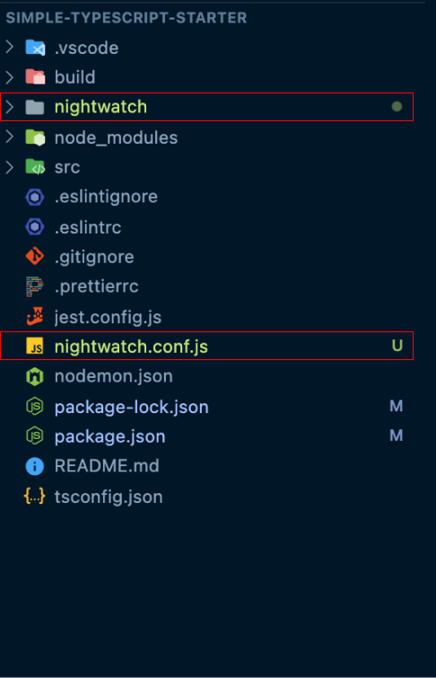

# Typescript Setup

We introduced a new tool called [Nightwatch Schematics][NightwatchSchematics], which helps you add Nightwatch config to your project, add sample tests and tsconfig for e2e tests.

First, you need to add [Schematics CLI][SchematicsCli] globally.

```bash
npm install -g @angular-devkit/schematics-cli
```

The above command will download schematics CLI, which is a template-based code generator. It helps in transforming a web-app project by generating or modifying code.


After that, install Nightwatch-schematics in your project, using the below command:

```bash
npm install @nightwatch/schematics
```

Once you have installed the Nightwatch schematics, you can add Nightwatch to your project by running:

```bash
schematics @nightwatch/schematics:ng-add
```

It will prompt you with a set of questions that guides you through the setup of Nightwatch. You can also pass `--remove-protractor --environment='<chrome/firefox/safari>'` to skip the questionnaire and install it with the environment provided.

This will create a `nightwatch` folder that contains tests and tsconfig, and `nightwatch.config.js` in the root folder.



We had also added `scripts command` in `package.json`. You can start your e2e tests by running the `e2e:test` command:

```
npm run e2e:test
```

All Nightwatch CLI options will be available when triggering e2e tests, you just have to update `e2e:test` command.

For example:
Adding `--headless` will run e2e tests in headless mode

```
"e2e:test": "./node_modules/.bin/tsc -p ./nightwatch/tsconfig.e2e.json && ./node_modules/.bin/nightwatch --env 'chrome' --config './nightwatch.conf.js'" --headless,
```

[NightwatchSchematics]:https://github.com/nightwatchjs/nightwatch-schematics/
[SchematicsCli]:https://www.npmjs.com/package/@angular-devkit/schematics-cli
